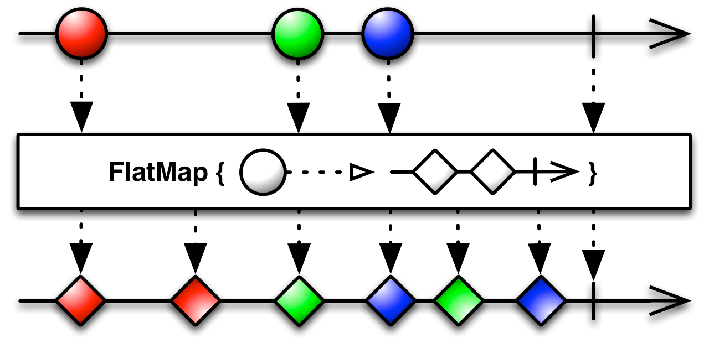
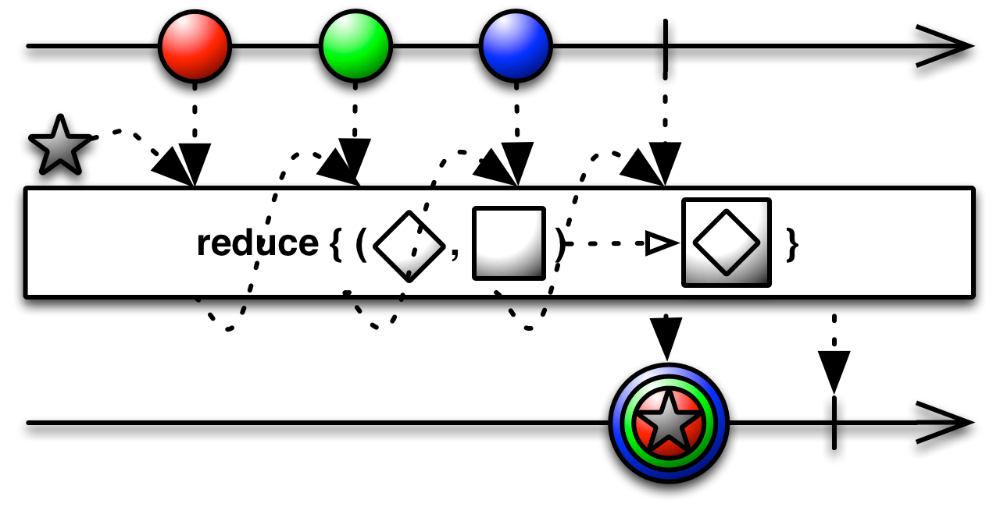

## Description

- __리액티브 연산자__ == __함수__

- 리액티브 연산자는 __부수 효과가 없는 순수 함수__ (follow. 함수형 프로그래밍의 원리)

- 리액티브 연산자 분류

  | 연산자                        | 설명                                       |
  | -------------------------- | ---------------------------------------- |
  | Creating                   | 데이터의 흐름을 만들어내는 함수<br/>`Observable`, `Single` 클래스가 있음<br/><br/>`just()`, `create()`, `fromXXX()` 시리즈,<br/>`interval()`, `range()`, `timer()`, `defer()` 등 |
  | Transforming               | 어떤 입력을 받아서 원하는 출력 결과를 내는 전통적인 의미의 함수<br/><br/>`map()`, `flatMap()` |
  | Filter                     | 입력 데이터 중에 원하는 데이터만 걸러냄<br/><br/>`filter()`, `first()`, `take()` 등 |
  | Combining                  | 여러 `Observable`을 조합하는 역할을 함<br/>RxJava의 묘미는 여러 개의 `Observable`을 생성하고 조합하는 것 |
  | Error Handling             | `onErrorReturn()`, `onErrorResumeNext()` |
  | Utility                    | 비동기 프로그래밍이 지원<br/><br/>`subscribeOn()`, `observeOn()` |
  | Conditional                | `Observable`의 흐름제어                       |
  | Mathematical and Aggregate | 수학 함수와 연관 있는 연산자                         |
  | Back pressure              | 배압 이슈에 대응하는 연산자                          |

## 3.1 `map()` 함수

- 입력 값을 __어떤 함수에 넣어서__ 원하는 값으로 변환하는 함수

- 원형

  ```java
  @CheckReturnValue
  @SchedulerSupport(value="none")
  public final <R> Observable<R> map(Function<? super T, ? extends R> mapper)
  ```

  - `@CheckReturnValue`: 리턴 값을 확인
  - `@SchedulerSupport(value="none")`: 스케줄러를 지원하지 않음

-  RxJava의 젠네릭 함수형 인터페이스

   | 인터페이스 이름         | 포함 메서드              | 설명                  |
   | ---------------- | ------------------- | ------------------- |
   | `Predicate<T>`   | `boolean test(T t)` | t 값을 받아서 참이나 거짓을 반환 |
   | `Consumer<T>`    | `void accept(T t)`  | t 값을 받아서 처리, 반환 값 X |
   | `Function<T, R>` | `R apply(T t)`      | t 값을 받아서 결과를 반환     |

- 예제

  ```java
  Function<String, String> getDiamond = ball -> "<" + ball ">";

  String[] balls = {"1", "2", "3"};
  Observable<String> source = Observable.fromArray(balls)
  	.map(getDiamond);
  source.subscribe(Log::i);
  ```

- 실행 결과

  ```
  main | value = <1>
  main | value = <2>
  main | value = <3>
  main | value = <4>
  ```

## 3.2 `flatMap()` 함수

- `map()` 함수를 좀 더 발전시킨 함수

- 결과가 `Observable`이며, 일대일 혹은 일대다 `Observable` 함수

- 마블 다이어그램

  

- 원형

  ```java
  @SchedulerSupport(SchedulerSupport.NONE)
  public final <R> Observable<R> flatMap(
  	Function<? super T, ? extends ObservableSource<? extends R>> mapper);
  ```

  - `ObservableSource`: `Observable`, `AsyncSubject`, `BehaviorSubject`, `ConnectableObservable` 등이 공통으로 구현한 __인터페이스__

  ```java
  @CheckReturnValue
  @SchedulerSupprot(SchedulerSupport.NONE)
  public final <U, R> Observable<R> flatMap(
  	Function<? super T, ? extends ObservableSource<? extends U>> mapper,
  	BiFunction<? super T, ? super U, ? extends R> resultSelector);
  ```

  - `BiFunction`은 `T`와 `U`를 인자로 받고 `R`을 리턴하는 __함수형 인터페이스__

- 예제

  ```java
  Function<String, Observable<String>> getDoubleDiamonds = ball ->
  	Observable.just("<" + ball + ">", "<" + ball + ">");

  String[] balls = { "1", "3", "5" };
  Observable<Strig> source = Observable.fromArray(balls)
  	.flatMap(getDoubleDiamonds);
  source.subscribe(Log::i);
  ```

- 실행 결과

  ```
  main | value = <1>
  main | value = <1>
  main | value = <3>
  main | value = <3>
  main | value = <5>
  main | value = <5>
  ```

- 구구단 구현

  - 실제 작성한 코드 참고

## 3.3 `filter()` 함수

- `Observable`에서 원하는 데이터만 걸러내는 역할

- 원형

  ```java
  @CheckReturnValue
  @SchedulerSupport(SchedulerSupport.NONE)
  public final Observable<T> filter(Predicate<? super T> predicate);
  ```

- 예제

  ```java
  String[] objs = { "1 CIRCLE", "2 DIAMOND", "3 TRIANGLE",
                    "4 DIAMOND", "5 CIRCLE", "6 HEXAGON" };
  Observable<String> source = Observable.fromArray(objs)
  	.filter(obj -> obj.endsWith("CIRCLE"));
  source.subscribe(System.out::println);
  ```

- 실행 결과

  ```
  1 CIRCLE
  5 CIRCLE
  ```

- `filter()` 함수와 비슷한 함수

  - `first(default)` 함수: `Observable`의 첫 번째 값을 필터, 값이 없으면 기본 값 리턴
  - `last(default)` 함수: `Observable`의 마지막 값을 필터, 값이 없으면 기본 값 리턴
  - `take(N)` 함수: 최초 N개 값만 가져옴
  - `takeLast(N)` 함수: 마지막 N개 값만 필터
  - `skip(N)` 함수: 최초 N개 값을 건너뜀
  - `skipLast(N)` 함수: 마지막 N개 값을 건너뜀

## 3.4 `Reduce()` 함수

- 발행한 데이터를 모두 사용하여 어떤 최종 결과 데이터를 합성할 때 활용

- __map, filter, reduce 패턴__을 이루는 마지막 필수 함수

- 마블 다이어그램
  

- 원형

  ```java
  @CheckReturnValue
  @SchedulerSupport(SchedulerSupport.NONE)
  public final Maybe<T> reduce(BiFunction<T, T, T> reducer);
  ```

  - `BiFunction`을 인자로 사용함

- 예제

  ```java
  String[] balls = { "1", "3", "5" };
  Maybe<String> source = Observable.fromArray(balls)
  	.reduce((ball1, ball2) -> ball2 + "(" + ball1 + ")");
  source.subscribe(System.out::println);
  ```

- 실행 결과

  ```
  5(3(1))
  ```

  ​